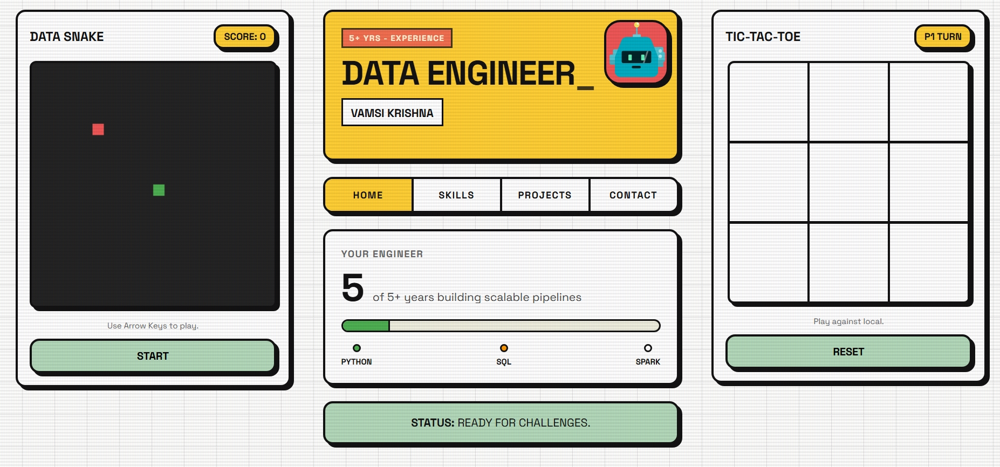

# Retro Data Engineer Portfolio



A brutalist, retro-arcade style portfolio designed for a Data Engineer, featuring custom 8-bit sound effects, a CRT scanline overlay, and playable mini-games (Data Snake and Tic-Tac-Toe).

## 🚀 How to Run Locally

Since this is a pure static website (HTML/CSS/JS) with no build tools or dependencies:
1. Open the folder.
2. Double-click `index.html` to open it in your web browser. 
3. *Note: The 8-bit sound effects will activate after your first click on the page due to browser autoplay policies.*

## 🛠️ How to Edit Content

### 1. Changing Text & Data (HTML)
Open `index.html` in your favorite code editor (like VS Code).
- **Name & Title**: Look for the `<h1 class="hero-title">` and `<span class="hero-subtitle">` tags.
- **Skills/Categories**: Look inside the `<div class="skills-grid">`. You can add new `<div class="skill-card">` elements. Make sure the `data-category` attribute matches the filters you want it to appear under (e.g., `data-category="etl cloud"`).
- **Projects**: Scroll down to `<div id="section-projects">` to update the project descriptions and titles.

### 2. Changing Colors (CSS)
Open `style.css` and look at the top `:root` variables:
```css
:root {
    --bg-color: #FDFDFC;
    --grid-color: #E2E2E2;
    --yellow: #FFCE33;
    --green: #B2D8B9;
    --red: #EE5555;
    --black: #111111;
}
```
Change any of these hex codes to instantly update the entire theme of the site.

### 3. Adjusting Games & Sounds (JavaScript)
Open `script.js`.
- **Sounds**: The `playSound(type)` function handles all audio using the Web Audio API. You can change frequencies, wave types (`square`, `sine`, `sawtooth`, `triangle`), and durations to make your own sounds.
- **Snake Speed**: Look for `gameLoopTimeout = setTimeout(drawSnakeGame, 100);` in the Snake section. Lower the number (e.g., 80) to make it faster, or raise it to make it slower.

## 📦 Pushing to GitHub

To store this project in GitHub, open your terminal (or command prompt), navigate to this folder, and run:

```bash
# Initialize git
git init

# Add all files
git add .

# Commit changes
git commit -m "Initial commit of Retro Portfolio"

# Add your GitHub repository link (replace with your actual link)
git branch -M main
git remote add origin https://github.com/YOUR-USERNAME/YOUR-REPO-NAME.git

# Push to GitHub
git push -u origin main
```

## 🌍 Deploying to Vercel (Making it Live)

Vercel is the easiest way to host a static website for free.

1. Go to [Vercel.com](https://vercel.com/) and create a free account (sign up with your GitHub account).
2. Go to your Vercel Dashboard and click **"Add New..." -> "Project"**.
3. Under "Import Git Repository", find the repository you just pushed to GitHub and click **"Import"**.
4. You don't need to change any build settings because this is a standard HTML site. Leave the "Framework Preset" as "Other".
5. Click **"Deploy"**.

Vercel will build your site in seconds and provide you with a live, shareable URL! Every time you push new code to your GitHub `main` branch, Vercel will automatically update your live website.
